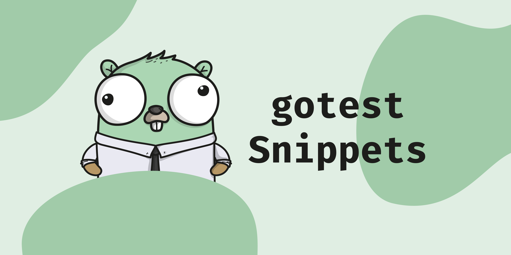

# gotest-snippets

This VSCode extension will make it a little easier to write tests in golang by
generating the majority of the boiler plate needed for common tests.

## Installation

To install the extension from VSCode:

1. Press `Ctrl + P` in VSCode
1. Enter the following: `ext install Gauntface.gotest-snippets`

Optionally, checkout the extension on the [VisualStudio Marketplace here](https://marketplace.visualstudio.com/items?itemName=Gauntface.gotest-snippets).

## Snippets

- gotest
    - Generate a table driven test
- gotest-diff
    - Generate a diff statement (i.e. a want/got check)
- gotest-diffopts
    - Generate a diff statement with options. This is equivalent to
      `gotest-diff` except it'll set up the options array.
- gotest-main
    - Generate a`TestMain` function with a `reset` function you can use to reset
      all global variables between tests.
- gotest-errors
    - Generate an error comparison.
- gotest-errinject
    - Generate an error to inject into test cases (useful for consistency).